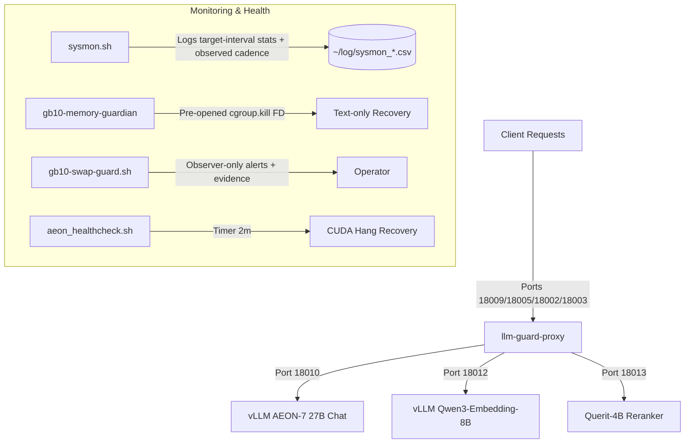

# GB10 AI Service Stack (DGX Spark OEM)

This repository contains the complete configuration, scripts, and systemd user services for deploying and maintaining the core AI inference service stack on a **DGX Spark** (or similar GB10-based OEM server). Its goal is to let an agent with GB10 operator access (`rootless-docker` plus `systemctl --user`) reproduce the same service layout used on the reference GB10 host.

The stack consists of **5 main services** (3 model endpoints, 1 loop/shielding proxy wrapper, and 1 system monitor) plus auxiliary helper services to ensure high availability, automatic failover, hang recovery, and memory protection.

---

## Architecture Overview



### The 5 Core Services
1. **vllm-aeon-27b-dflash.service**
   Serves the uncensored chat model (`aeon-ultimate`) utilizing the `DFlash` speculative decoding draft model. This is run inside the pinned AEON v0.24 GB10 Docker image for long-context processing up to 256k tokens, with FP8 KV cache and DFlash `TRITON_ATTN` enabled.
2. **vllm-embedding.service**
   Serves BF16 `Qwen/Qwen3-Embedding-8B` with its full 4,096-dimensional output. This is the reliability-critical baseline service. The tracked source profile contracts for 32,768 tokens, 4,800 MiB explicit KV, and a 20 GiB no-swap hard cap while preserving 8,192 batched tokens, 64 sequences, aliases, and quality semantics. Its raw backend listens only on port `18012`; clients should use `llm-guard-proxy` on port `18009` or the guard-owned legacy listener `18002` with model `qwen3-embedding-8b`.
3. **querit-4b-reranker.service**
   Serves the pinned `Querit/Querit-4B` snapshot through a bounded, single-inference Transformers adapter. It keeps the `qwen3-reranker-8b` and `Qwen/Qwen3-Reranker-8B` aliases, a 40,960-token input profile, and an 18 GiB no-swap container cap. Its raw backend listens on `18013`; clients should use `llm-guard-proxy` on `18009` or the restricted listener `18003`. The old `vllm-qwen3-reranker-8b.service` remains tracked only as a disabled rollback artifact.
4. **llm-guard-proxy.service**
   A Rust-based shielding gateway proxy ([llm-guard-proxy](https://github.com/RyderFreeman4Logos/llm-guard-proxy)) sitting in front of the chat, embedding, and reranker endpoints. It routes requests by `model` to named upstream profiles, manages request queues, retries, stalls, and loop guards to protect backends from runaway generations. It owns the stable entrypoint `18009`, aggregate listener `18005`, and legacy restricted listeners `18002`/`18003`; raw vLLM backends stay on `18010`/`18012`/`18013`. It is also the runtime control plane for request concurrency: edit `config/llm-guard-proxy/config.toml` to tune the default/chat `server.max_in_flight_requests` / `server.max_queued_generation_requests` and the named `[[upstreams]]` limits for embedding and reranker. The running proxy hot-reloads these limits so operators can choose throughput versus single-stream latency without restarting vLLM.

   Queueing belongs primarily in Guard, not in an unbounded raw model adapter. The reference profile permits four concurrent body-routing reads and queues 128 requests before model routing; after routing it allows 4 active + 64 queued AEON requests, 8 + 64 embedding requests, and 8 + 64 Querit requests. Queued requests may wait up to 30 minutes. Only the 128-slot body-routing wait is pre-body and cheap; profile queues retain request bodies, so Guard caps every request at 4 MiB. The worst-case 216 body residencies use a documented 384 MiB baseline plus 1.5× body-overhead budget (1,680 MiB), below `MemoryHigh=1792M` and `MemoryMax=2G`. Querit admits at most sixteen backend connections through Uvicorn (leaving headroom for eight Guard-active requests plus health/control traffic); those bounded active requests serialize only the GPU inference section on a process lock, while the larger burst remains in Guard. AEON keeps a much higher vLLM scheduling ceiling (`--max-num-seqs 64`), calculated as `262144 / 8192 * 2`; Guard's lower hot-reloadable profile limit controls actual production concurrency.

   The reference config enables the production guard features that are useful on
   GB10: explicit named upstream profiles, bounded generation queues with HTTP
   `429`/`Retry-After`, model metadata enrichment, AEON chat hot-restart probes,
   stall detection, request parameter overrides for the AEON service-unit
   sampling defaults (`temperature=0.6`, `top_p=0.95`, `top_k=20`,
   `max_tokens=50000`), semantic loop detection, metrics, debug summaries,
   SQLite observability, full quality-debug evidence logging, SSE heartbeats, and
   Cloudflare-friendly streaming. Reasoning-loop failures use private CoT
   salvage (`loop_guard.on_reasoning_loop = "bounded_answer_from_cot"`) so the
   retry can answer from a bounded pre-loop reasoning prefix instead of falling
   straight to a no-thinking attempt. The proxy still keeps a shielded AEON
   retry ladder: max thinking, deep bounded thinking, bounded thinking, and
   final no-thinking fallback.

   Evidence is intentionally configured for loop-detector improvement rather
   than privacy-minimal production: redacted raw payloads, selected request
   headers, raw reasoning, loop shadow continuations, and 100% paired
   max/bounded/no-thinking comparisons are recorded within bounded retention.

   Normal chat uses `mode = "bounded_thinking"` with a 32,768-token thinking
   budget and explicit `vllm_native` injection: Guard preserves the template
   `enable_thinking` marker and sends the effective budget through vLLM's
   top-level `thinking_token_budget` field. Client no-thinking markers are respected:
   a request with `"chat_template_kwargs": {"enable_thinking": false}` should
   pass through without `reasoning_content`. Embedding and reranker profiles
   explicitly disable chat-only hot-restart probes, thinking rewrites, and
   parameter overrides.
5. **sysmon.service**
   A lightweight observer-only system monitor targeting a one-second interval,
   recording system load, exact Linux `MemAvailable`, temperatures, GPU metrics,
   disk I/O rates, swap-in/out, top process RSS/swap memory, and observed cadence.
   CSV v5 appends `mem_available_mb`, `sample_cadence_ms`,
   `sample_elapsed_ms`, and `sample_lag_ms` without reordering v4 columns. A
   2–3 second loop overrun is recorded as such; the service does not claim a
   guaranteed 1 Hz sampling rate and performs no recovery action.

### Auxiliary Services
*   **gb10-memory-guardian.service**: Keeps a touched 64 MiB reserve, polls a pre-opened `/proc/meminfo` descriptor once per second, and releases the reserve before writing directly to the configured text target's retained `cgroup.kill` descriptor below the strict 1 GiB `MemAvailable` threshold. It hot-reloads an owner-only TOML config transactionally and accepts only an atomic registration for the exact rootless Docker path under the current user's `app.slice`; invalid config candidates preserve the last-good target, while missing, stale, malformed, traversal, or symlinked active registrations disarm it.
*   **gb10-swap-guard.service**: An observer-only one-second `MemAvailable` and swap monitor. It emits alerts and bounded read-only evidence but never stops, kills, or restarts a service or container.
*   **aeon-healthcheck.timer & service**: A systemd timer that triggers every 2 minutes to check vLLM metrics. It automatically restarts the chat service if it detects a CUDA kernel hang (running requests with zero tokens/s and low GPU power).

The Rust guardian is the sole automatic recovery actor. Its allocation-audited
emergency path needs neither Docker, D-Bus, configuration parsing, nor a
subprocess after the reserve is released. Only the text unit publishes the
configured registration; `Restart=on-failure` lets systemd converge after the
direct cgroup kill. Embedding and both rerankers are lifecycle-independent and
must retain the same state, `MainPID`, and restart count during text recovery.
The Bash swap observer remains enabled only for alerts and evidence.

### Reference Production Profile (source updated 2026-07-14)

The reference host runs all three model containers from this pinned image digest:

```text
ghcr.io/aeon-7/aeon-vllm-ultimate:2026-07-01-v0.24.0
digest: sha256:f6d453d0b4a7ef90eefee486f4ff769cc2e1bb1e206df16d70370da09c02203c
```

Capacity contracts and evidence:

```text
embedding:  source max-model-len 32,768, KV 4,800M -> projected 34,124 tokens (4.14% margin; live verification pending)
            validated baseline: KV 5,820M -> 41,376 tokens
AEON chat:  max-model-len 262,144, FP8 KV 15,360M -> verified 269,589 tokens (1.028 full contexts)
Querit:     snapshot 7b796de30ad8dc772d6c46c75659c1341283a665, max-model-len 40,960, MemoryMax 18G
```

The committed container/cgroup caps are AEON 69G + embedding 20G + Querit 18G = 107 GiB, but that arithmetic is policy and does not guarantee physical NVML/UMA headroom. With the former 36 GiB text KV profile, stable all-three samples left only about 1.8–2.3 GiB `MemAvailable`, and the same text configuration had previously grown another 8,466 MiB. The live 15 GiB text KV activation reported 269,589 cache tokens, a 2.84% margin above one 262,144-token request, and the first 3,300-second attribution window ended with about 31.6 GiB `MemAvailable`, zero threshold events, and zero cgroup OOM kills. Two concurrent maximum-length requests are not supported; this is intentional under the service priority embedding > reranker > text. Use `scripts/gb10_apply_aeon_querit_profile.sh` for the reranker migration; it verifies the source AEON 15,360 MiB KV profile and does not restart AEON unless `--restart-aeon` is explicit.

---

## Directory Structure

```text
gb10-services/
├── Cargo.toml              # Persistent Rust workspace (resolver 2)
├── Cargo.lock              # Reviewed dependency lock
├── LICENSE
├── README.md               # User guide (human-facing)
├── AGENTS.md               # Automated playbook (agent-facing)
├── config/
│   ├── gb10-memory-guardian/
│   │   └── config.toml     # Generic runtime-relative recovery target
│   └── llm-guard-proxy/
│       └── config.toml     # llm-guard-proxy shielding rules & limits
├── crates/
│   ├── gb10-memory-guardian-core/ # Parsers, registration, retained FDs, kill path
│   └── gb10-memory-guardian/      # Polling user-service binary
├── docs/research/          # Tracked dated source/live research and decisions
├── scripts/
│   ├── aeon_chat_ready.py  # Waits for Chat vLLM metrics endpoint before starting reranker
│   ├── aeon_hang_guard.py  # Python hook script for Docker container hang protection
│   ├── aeon_healthcheck.sh # Main loop/CUDA hang detection bash script
│   ├── aeon_vllm_wrapper.py# Wrapper startup script for vLLM container
│   ├── gb10_apply_aeon_querit_profile.sh # Guarded Querit migration/deployer
│   ├── gb10_check_mem_available.sh # Model startup headroom gate
│   ├── gb10_deploy_memory_guardian.sh # Fail-closed guardian installer/activator
│   ├── gb10_enforce_docker_cgroup_limits.sh # Rootless container hard caps
│   ├── gb10_memory_guardian_canary.sh # Disposable canary/read-only identity proof
│   ├── gb10-swap-guard.sh  # Observer-only MemAvailable/swap evidence
│   ├── querit_openai_rerank_server.py # Bounded OpenAI-compatible adapter
│   └── sysmon.sh           # Observer-only metrics with measured sample cadence
└── systemd/
    ├── aeon-healthcheck.service
    ├── aeon-healthcheck.timer
    ├── gb10-swap-guard.service
    ├── gb10-memory-guardian-canary.service
    ├── gb10-memory-guardian.service
    ├── llm-guard-proxy.service
    ├── querit-4b-reranker.service
    ├── sysmon.service
    ├── vllm-aeon-27b-dflash.service
    ├── vllm-embedding.service
    └── vllm-qwen3-reranker-8b.service # disabled fallback only
```

---

## Prerequisites & Installation

### 1. Rootless Docker
The vLLM stack runs inside Docker. For safety and isolation, **Rootless Docker** is recommended.
* Ensure the Docker daemon socket is active at `unix:///run/user/$(id -u)/docker.sock`.
* Add `export DOCKER_HOST=unix:///run/user/$(id -u)/docker.sock` to your shell profile.

### 2. Hugging Face Models Cache
Pre-download the required model weights into `~/.cache/huggingface/` or prepare your local directories:
* **Chat Model**: `Qwen/Qwen3.6-27B-AEON-Ultimate-Uncensored-Multimodal-NVFP4-MTP-XS`
* **DFlash Draft Model**: `z-lab/Qwen3.6-27B-DFlash`
* **Embedding Model**: `Qwen/Qwen3-Embedding-8B`
* **Reranker Model**: `Querit/Querit-4B`, snapshot `7b796de30ad8dc772d6c46c75659c1341283a665`

### 3. Build llm-guard-proxy
Build/update the proxy binary on the host machine from the reviewed main branch.
The cached rebuild script uses a local workspace checkout plus a persistent Cargo
target cache, so path dependencies such as `llm-guard-proxy-core` are built from
the same commit and future GB10 updates do not recompile dependencies from
scratch:
```bash
~/.local/bin/llm_guard_proxy_cached_rebuild.sh
```

The script keeps build artifacts in
`~/.cache/cargo-target/llm-guard-proxy-main` and relinks
`~/.local/bin/llm-guard-proxy` to the workspace-built release binary. If a
standalone rebuild leaves the running guard process on a deleted old inode, the
script restarts only `llm-guard-proxy.service` and smokes `/health`; it does not
restart any vLLM backend.

### 4. Build and verify the memory guardian

Build from the locked persistent workspace and record the source-built binary
checksum before installation:

```bash
cargo fmt --check
cargo clippy --workspace --all-targets -- -D warnings
cargo test --workspace --locked
cargo build --release --locked -p gb10-memory-guardian
sha256sum target/release/gb10-memory-guardian | tee /tmp/gb10-memory-guardian.source.sha256
```

The guardian uses `libc` for its direct Linux path plus `notify`, `serde`, and
`toml` for healthy-path transactional config reloads. Every Linux FFI call is
localized to a documented unsafe block; the service binary contains no
subprocess API.
The GB10 user manager rejects `PrivateDevices`, `ProtectClock`,
`ProtectKernelLogs`, and `ProtectKernelModules` with `218/CAPABILITIES`; those
four directives are intentionally omitted. The unprivileged service retains
`NoNewPrivileges` and the remaining namespace, filesystem, address-family,
and kernel-tunable restrictions.
GB10 also clamps unprivileged user units to an effective
`OOMScoreAdjust=100`; lower configured values are not applied. The units state
that real floor explicitly. The guardian remains below the large model
services (200/500/800), while its verified 64 MiB cgroup `MemoryMin` protects
the resident emergency mapping directly.
The 64 MiB reserve is an explicit anonymous `mmap`; emergency release uses
`munmap`, and the reserve is not rearmed until `MemAvailable` reaches the
1 GiB stop threshold plus the reserve size.
Synthetic fault tests may override `GB10_MEMORY_GUARDIAN_MEMINFO_PATH`,
`GB10_MEMORY_GUARDIAN_CGROUP_ROOT`, and
`GB10_MEMORY_GUARDIAN_CONFIG_PATH`. Production defaults are `/proc/meminfo`,
`/sys/fs/cgroup`, and `$XDG_CONFIG_HOME/gb10-memory-guardian/config.toml` (or
`$HOME/.config/gb10-memory-guardian/config.toml`). The config must be a regular,
single-link, owner-only file; install it with mode `0600`.

---

## Deployment Steps

### Step 1: Copy Scripts and Configurations
Make sure target directories exist, then copy scripts to your local bin and configurations:
```bash
mkdir -p ~/scripts ~/.local/bin ~/.config/llm-guard-proxy ~/log
install -d -m 0700 ~/.config/gb10-memory-guardian

# Copy scripts
cp scripts/aeon_vllm_wrapper.py ~/scripts/
cp scripts/aeon_hang_guard.py ~/scripts/
cp scripts/aeon_healthcheck.sh ~/scripts/
cp scripts/aeon_chat_ready.py ~/.local/bin/
cp scripts/gb10_apply_aeon_querit_profile.sh ~/.local/bin/
cp scripts/gb10_check_mem_available.sh ~/.local/bin/
cp scripts/llm_guard_proxy_cached_rebuild.sh ~/.local/bin/
cp scripts/querit_openai_rerank_server.py ~/.local/bin/
cp scripts/sysmon.sh ~/.local/bin/
cp scripts/gb10-swap-guard.sh ~/.local/bin/

# Make scripts executable
chmod +x ~/scripts/*.sh ~/.local/bin/*

# Copy llm-guard-proxy config
cp config/llm-guard-proxy/config.toml ~/.config/llm-guard-proxy/config.toml
```

> [!NOTE]
> Update the IP address `100.105.4.92` in `systemd/*.service` and `config/llm-guard-proxy/config.toml` to match your local or Tailscale network interface IP address.

### Step 2: Install non-guardian Systemd Services
Install only units outside the guardian/text/reranker activation transaction:
```bash
mkdir -p ~/.config/systemd/user/
install -m 0644 systemd/aeon-healthcheck.service systemd/aeon-healthcheck.timer \
  systemd/gb10-swap-guard.service systemd/llm-guard-proxy.service \
  systemd/sysmon.service systemd/vllm-embedding.service \
  ~/.config/systemd/user/
```

### Step 3: Enable and Start the Stack
Reload systemd configurations and enable the services to persist across boot cycles:
```bash
systemctl --user daemon-reload

# Enable auxiliary services
systemctl --user enable --now sysmon.service
systemctl --user enable --now gb10-swap-guard.service
systemctl --user enable --now aeon-healthcheck.timer

# Install the complete reviewed guardian/text/reranker transaction while the
# automatic actor remains stopped and disabled.
export GB10_BENCHMARK_EXCLUDED=YES
scripts/gb10_deploy_memory_guardian.sh install

# Enable model services. Starting text is a separate operator action; the
# deployer itself never restarts or kills a production model.
systemctl --user enable --now vllm-embedding.service
systemctl --user enable --now vllm-aeon-27b-dflash.service
systemctl --user disable --now vllm-qwen3-reranker-8b.service
systemctl --user enable --now querit-4b-reranker.service
systemctl --user enable --now llm-guard-proxy.service

# On a stale upgrade, inspect and explicitly remove the obsolete volatile
# Querit registration only after confirming the installed reranker is decoupled.
test ! -e "$XDG_RUNTIME_DIR/gb10-memory-guardian/querit-cgroup.v1" || {
  grep -q 'lifecycle-independent' ~/.config/systemd/user/querit-4b-reranker.service
  rm -f "$XDG_RUNTIME_DIR/gb10-memory-guardian/querit-cgroup.v1"
}
scripts/gb10_deploy_memory_guardian.sh activate
```

Activate the guardian separately with the fail-closed source-first deployer.
It first stops any stale guardian, then installs the current release binary,
helper, canary, owner-only `config.toml`, guardian units, text unit, and both
reviewed lifecycle-independent reranker units. No wildcard unit copy or manual
guardian `enable --now` is an acceptable activation path. The exact target must
remain label `aeon-text` with `registration_file = "text-cgroup.v1"`.
The deployer uses `install -m 0600` for that owner-only config.

The install phase leaves the automatic actor disabled. Activation refuses and
keeps it stopped if the owner-only config is missing or wrong, any stale
`querit-cgroup.v1` exists, the text unit does not publish `text-cgroup.v1`, the
disposable canary fails, strict bounded systemd status is not
`loaded/active/running`, or the post-start journal does not contain an exact
`armed target aeon-text` receipt. The final configured-target phase is a
read-only configured-target identity check; it never kills production text.
The registration contains only the version, exact 64-character lowercase
Docker ID, exact scope, and exact control-group path. Publication failure stops
only that unit's exact launched container before systemd can manage it further.

The text unit has `Restart=on-failure`, so a guardian cgroup kill converges
through systemd. It has only non-owning ordering after embedding; neither text
nor Guard starts or restarts embedding. Both reranker alternatives are
lifecycle-independent from text, retain their mutual `Conflicts=`, and have no
text-readiness startup gate. The Querit unit neither publishes a guardian
registration nor pulls in the guardian. `llm-guard-proxy.service` has ordering
only and owns no backend lifecycle. The AEON healthcheck can restart text but
has no embedding/reranker action.

### Embedding 32K profile activation and rollback

The tracked 32,768-token / 4,800 MiB KV / 20 GiB profile is source-first and
must be activated as a **single-unit** canary. Do not stop or restart text or
either reranker, and do not copy/sync unrelated files from this branch. Before
installation, use the complete canary in
`docs/research/2026-07-14-vllm-upgrade-and-embedding-memory.md` to save the
installed embedding unit, embedding state/runtime/cgroup receipts, a fixed
synthetic output from both aliases, and text/reranker `ActiveState`, `MainPID`,
and `NRestarts`.

Run the activation from the repository root only after those pre-state receipts
exist:

```bash
install -m 0644 systemd/vllm-embedding.service \
  "${XDG_CONFIG_HOME:-$HOME/.config}/systemd/user/vllm-embedding.service"
timeout 10s systemctl --user daemon-reload
ACTIVATED_AT=$(date --iso-8601=seconds)
timeout 15s systemctl --user --no-block restart vllm-embedding.service
timeout 92s bash -c '
  until systemctl --user is-active --quiet vllm-embedding.service &&
    curl --fail --silent --show-error --max-time 2 \
      http://100.105.4.92:18012/v1/models >/dev/null; do
    sleep 2
  done
'
```

Accept only after the detailed canary verifies the running Docker argv has
`--max-model-len 32768`, startup reports at least 32,768 KV tokens, both aliases
return finite 4,096-dimensional vectors at the documented cosine-parity
threshold, Docker and cgroup limits are exactly 20 GiB with no swap/cap event,
and every saved text/reranker state/PID/restart-count tuple is byte-for-byte
unchanged. Until those receipts exist, the profile is projected and **not
production-verified**.

On any failure, preserve the failed receipts, restore only the saved embedding
unit, reload systemd, and restart only embedding; do not attempt a full-stack
recovery:

```bash
: "${EVIDENCE:?set EVIDENCE to the canary receipt directory}"
install -m 0644 "$EVIDENCE/vllm-embedding.service.before" \
  "${XDG_CONFIG_HOME:-$HOME/.config}/systemd/user/vllm-embedding.service"
timeout 10s systemctl --user daemon-reload
timeout 15s systemctl --user --no-block restart vllm-embedding.service
timeout 92s bash -c '
  until systemctl --user is-active --quiet vllm-embedding.service; do sleep 2; done
'
```

The research note contains executable pre/post snapshots, deterministic output
comparison, capacity/cgroup checks, neighbor comparison, and rollback receipts.

### Memory-guardian disposable canary and read-only identity proof

These are deployment procedures, not automated tests. Do not run either phase
while a benchmark is active, and do not move, rewrite, truncate, or otherwise
touch benchmark artifacts or benchmark processes. First confirm that the
benchmark owner has stopped or explicitly excluded all load, then run the rigid
disposable user cgroup canary:

```bash
export GB10_BENCHMARK_EXCLUDED=YES
~/.local/bin/gb10_memory_guardian_canary.sh disposable
```

The script creates only
`gb10-memory-guardian-disposable-canary.service` in the user `app.slice`; the
binary's disposable mode accepts no target path. The kill is executed through
`gb10-memory-guardian-canary.service`, a sandboxed oneshot with production
hardening. It snapshots text, embedding, both rerankers, Guard, and the
production guardian with strictly parsed `LoadState`, `ActiveState`, `SubState`,
`MainPID`, `Result`, exit status, and `NRestarts`. Every systemd query has a hard
timeout. A one-hour, binary-checksum-bound attestation is written only when all
protected tuples remain invariant.

The configured-target phase is read-only. It never invokes the guardian's
`--kill-configured-target` mode and never stops, starts, or restarts text. Supply
the exact activation timestamp so the bounded journal query cannot accept an
old `armed target` receipt:

```bash
GB10_BENCHMARK_EXCLUDED=YES \
GB10_MEMORY_GUARDIAN_CANARY_TARGET_UNIT=vllm-aeon-27b-dflash.service \
GB10_MEMORY_GUARDIAN_JOURNAL_SINCE="$ACTIVATED_AT" \
  ~/.local/bin/gb10_memory_guardian_canary.sh configured-target
```

It accepts only the owner-only `aeon-text` / `text-cgroup.v1` config, validates
the exact current-user `app.slice` registration, checks that the text unit
publishes that path with `Restart=on-failure`, requires a strict running guardian
state, and matches an exact `gb10-memory-guardian: armed target aeon-text`
journal line without changing embedding and both rerankers. Missing or hostile fields, substring matches, stale
`querit-cgroup.v1`, and unbounded status reads fail closed.

### Guardian rollback

Keep previous binary and unit checksums before deployment. To roll back, stop
and disable only the Rust guardian, remove the volatile text registration, and
restore the reviewed prior config/unit/helper files. Do not restart any vLLM
backend as part of guardian rollback:

```bash
systemctl --user disable --now gb10-memory-guardian.service
rm -f "$XDG_RUNTIME_DIR/gb10-memory-guardian/text-cgroup.v1"
# Restore reviewed prior files in ~/.config/systemd/user and ~/.local/bin here.
systemctl --user daemon-reload
systemctl --user is-active gb10-swap-guard.service
sha256sum ~/.local/bin/gb10-memory-guardian 2>/dev/null || true
```

The Bash swap guard is observer-only and is not a recovery fallback. Any model
restart after rollback is a separate, explicit operator decision.

---

## Verifying Status

* **Process Status**:
  ```bash
  systemctl --user status vllm-embedding vllm-aeon-27b-dflash querit-4b-reranker llm-guard-proxy sysmon
  ```
* **Checking logs**:
  ```bash
  journalctl --user -u llm-guard-proxy.service -f
  ```
* **Performance Monitor**:
  The system monitor `sysmon` appends logs to `~/log/sysmon_$(date +%F).csv`. You can monitor real-time resource usage by tailing this file:
  ```bash
  tail -f ~/log/sysmon_$(date +%Y-%m-%d).csv
  ```

---

## License

This repository is licensed under the Apache License 2.0. See the `LICENSE` file for details.
