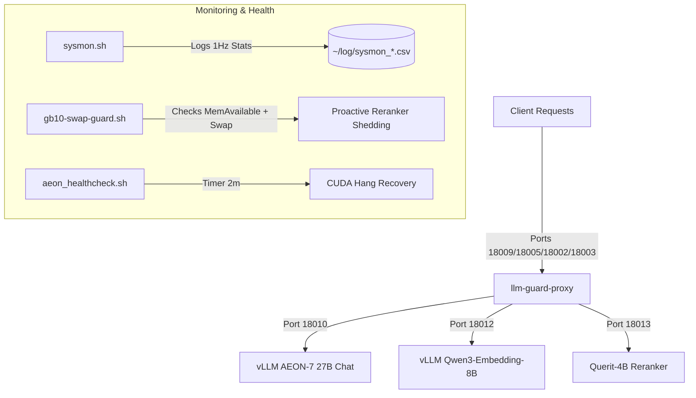

# GB10 AI Service Stack (DGX Spark OEM)

This repository contains the complete configuration, scripts, and systemd user services for deploying and maintaining the core AI inference service stack on a **DGX Spark** (or similar GB10-based OEM server). Its goal is to let an agent with GB10 operator access (`rootless-docker` plus `systemctl --user`) reproduce the same service layout used on the reference GB10 host.

The stack consists of **5 main services** (3 model endpoints, 1 loop/shielding proxy wrapper, and 1 system monitor) plus auxiliary helper services to ensure high availability, automatic failover, hang recovery, and memory protection.

---

## Architecture Overview



### The 5 Core Services
1. **vllm-aeon-27b-dflash.service**
   Serves the uncensored chat model (`aeon-ultimate`) utilizing the `DFlash` speculative decoding draft model. This is run inside the pinned AEON v0.24 GB10 Docker image for long-context processing up to 256k tokens, with FP8 KV cache and DFlash `TRITON_ATTN` enabled.
2. **vllm-embedding.service**
   Serves `Qwen/Qwen3-Embedding-8B` to handle vector embeddings. This is considered the reliability-critical baseline service. Its raw backend listens only on port `18012`; clients should use `llm-guard-proxy` on port `18009` or the guard-owned legacy listener `18002` with model `qwen3-embedding-8b`.
3. **querit-4b-reranker.service**
   Serves the pinned `Querit/Querit-4B` snapshot through a bounded, single-inference Transformers adapter. It keeps the `qwen3-reranker-8b` and `Qwen/Qwen3-Reranker-8B` aliases, a 40,960-token input profile, and an 18 GiB no-swap container cap. Its raw backend listens on `18013`; clients should use `llm-guard-proxy` on `18009` or the restricted listener `18003`. The old `vllm-qwen3-reranker-8b.service` remains tracked only as a disabled rollback artifact.
4. **llm-guard-proxy.service**
   A Rust-based shielding gateway proxy ([llm-guard-proxy](https://github.com/RyderFreeman4Logos/llm-guard-proxy)) sitting in front of the chat, embedding, and reranker endpoints. It routes requests by `model` to named upstream profiles, manages request queues, retries, stalls, and loop guards to protect backends from runaway generations. It owns the stable entrypoint `18009`, aggregate listener `18005`, and legacy restricted listeners `18002`/`18003`; raw vLLM backends stay on `18010`/`18012`/`18013`. It is also the runtime control plane for request concurrency: edit `config/llm-guard-proxy/config.toml` to tune the default/chat `server.max_in_flight_requests` / `server.max_queued_generation_requests` and the named `[[upstreams]]` limits for embedding and reranker. The running proxy hot-reloads these limits so operators can choose throughput versus single-stream latency without restarting vLLM.

   Queueing belongs primarily in Guard, not in an unbounded raw model adapter. The reference profile permits four concurrent body-routing reads and queues 128 requests before model routing; after routing it allows 4 active + 64 queued AEON requests, 8 + 64 embedding requests, and 8 + 64 Querit requests. Queued requests may wait up to 30 minutes. Only the 128-slot body-routing wait is pre-body and cheap; profile queues retain request bodies, so Guard caps every request at 4 MiB. The worst-case 216 body residencies use a documented 384 MiB baseline plus 1.5× body-overhead budget (1,680 MiB), below `MemoryHigh=1792M` and `MemoryMax=2G`. Querit admits at most sixteen backend connections through Uvicorn (leaving headroom for eight Guard-active requests plus health/control traffic); those bounded active requests serialize only the GPU inference section on a process lock, while the larger burst remains in Guard. AEON keeps a much higher vLLM scheduling ceiling (`--max-num-seqs 64`), calculated as `262144 / 8192 * 2`; Guard's lower hot-reloadable profile limit controls actual production concurrency.

   The reference config enables the production guard features that are useful on
   GB10: explicit named upstream profiles, bounded generation queues with HTTP
   `429`/`Retry-After`, model metadata enrichment, AEON chat hot-restart probes,
   stall detection, request parameter overrides for the AEON service-unit
   sampling defaults (`temperature=0.6`, `top_p=0.95`, `top_k=20`,
   `max_tokens=50000`), semantic loop detection, metrics, debug summaries,
   SQLite observability, full quality-debug evidence logging, SSE heartbeats, and
   Cloudflare-friendly streaming. Reasoning-loop failures use private CoT
   salvage (`loop_guard.on_reasoning_loop = "bounded_answer_from_cot"`) so the
   retry can answer from a bounded pre-loop reasoning prefix instead of falling
   straight to a no-thinking attempt. The proxy still keeps a shielded AEON
   retry ladder: max thinking, deep bounded thinking, bounded thinking, and
   final no-thinking fallback.

   Evidence is intentionally configured for loop-detector improvement rather
   than privacy-minimal production: redacted raw payloads, selected request
   headers, raw reasoning, loop shadow continuations, and 100% paired
   max/bounded/no-thinking comparisons are recorded within bounded retention.

   Normal chat uses `mode = "bounded_thinking"` with a 32,768-token thinking
   budget and `chat_template_kwargs` injection. Client no-thinking markers are respected:
   a request with `"chat_template_kwargs": {"enable_thinking": false}` should
   pass through without `reasoning_content`. Embedding and reranker profiles
   explicitly disable chat-only hot-restart probes, thinking rewrites, and
   parameter overrides.
5. **sysmon.service**
   A lightweight system monitor script executing at 1Hz, recording system load, temperatures, GPU metrics, disk I/O rates, swap-in/out, and top process RSS/swap memory consumption.

### Auxiliary Services
*   **gb10-swap-guard.service**: Polls `MemAvailable` every second and swap pressure while logging ordinary samples every 20 seconds. It sheds Querit first below 1 GiB available or at the swap stop threshold, preserving headroom for chat, embedding, Guard, and the control plane.
*   **aeon-healthcheck.timer & service**: A systemd timer that triggers every 2 minutes to check vLLM metrics. It automatically restarts the chat service if it detects a CUDA kernel hang (running requests with zero tokens/s and low GPU power).

### Reference Production Profile (2026-07-11)

The reference host runs all three model containers from this pinned image digest:

```text
ghcr.io/aeon-7/aeon-vllm-ultimate:2026-07-01-v0.24.0
digest: sha256:f6d453d0b4a7ef90eefee486f4ff769cc2e1bb1e206df16d70370da09c02203c
```

Verified startup capacities:

```text
embedding:  max-model-len 40,960, KV 5,820M -> 41,376 tokens = 1.01015625x
AEON chat:  max-model-len 262,144, FP8 KV 36,864M, MemoryMax 69G
Querit:     snapshot 7b796de30ad8dc772d6c46c75659c1341283a665, max-model-len 40,960, MemoryMax 18G
```

The committed ordinary model caps are AEON 69G + embedding 24G + Querit 18G = 111 GiB. Use `scripts/gb10_apply_aeon_querit_profile.sh` for the reranker migration; it verifies the production AEON 36,864 MiB KV profile and does not restart AEON unless `--restart-aeon` is explicit.

---

## Directory Structure

```text
gb10-services/
├── LICENSE
├── README.md               # User guide (human-facing)
├── AGENTS.md               # Automated playbook (agent-facing)
├── config/
│   └── llm-guard-proxy/
│       └── config.toml     # llm-guard-proxy shielding rules & limits
├── scripts/
│   ├── aeon_chat_ready.py  # Waits for Chat vLLM metrics endpoint before starting reranker
│   ├── aeon_hang_guard.py  # Python hook script for Docker container hang protection
│   ├── aeon_healthcheck.sh # Main loop/CUDA hang detection bash script
│   ├── aeon_vllm_wrapper.py# Wrapper startup script for vLLM container
│   ├── gb10_apply_aeon_querit_profile.sh # Guarded Querit migration/deployer
│   ├── gb10_check_mem_available.sh # Model startup headroom gate
│   ├── gb10_enforce_docker_cgroup_limits.sh # Rootless container hard caps
│   ├── gb10-swap-guard.sh  # Fast MemAvailable/swap guard
│   ├── querit_openai_rerank_server.py # Bounded OpenAI-compatible adapter
│   └── sysmon.sh           # System performance and process metric logger (1Hz)
└── systemd/
    ├── aeon-healthcheck.service
    ├── aeon-healthcheck.timer
    ├── gb10-swap-guard.service
    ├── llm-guard-proxy.service
    ├── querit-4b-reranker.service
    ├── sysmon.service
    ├── vllm-aeon-27b-dflash.service
    ├── vllm-embedding.service
    └── vllm-qwen3-reranker-8b.service # disabled fallback only
```

---

## Prerequisites & Installation

### 1. Rootless Docker
The vLLM stack runs inside Docker. For safety and isolation, **Rootless Docker** is recommended.
* Ensure the Docker daemon socket is active at `unix:///run/user/$(id -u)/docker.sock`.
* Add `export DOCKER_HOST=unix:///run/user/$(id -u)/docker.sock` to your shell profile.

### 2. Hugging Face Models Cache
Pre-download the required model weights into `~/.cache/huggingface/` or prepare your local directories:
* **Chat Model**: `Qwen/Qwen3.6-27B-AEON-Ultimate-Uncensored-Multimodal-NVFP4-MTP-XS`
* **DFlash Draft Model**: `z-lab/Qwen3.6-27B-DFlash`
* **Embedding Model**: `Qwen/Qwen3-Embedding-8B`
* **Reranker Model**: `Querit/Querit-4B`, snapshot `7b796de30ad8dc772d6c46c75659c1341283a665`

### 3. Build llm-guard-proxy
Build/update the proxy binary on the host machine from the reviewed main branch.
The cached rebuild script uses a local workspace checkout plus a persistent Cargo
target cache, so path dependencies such as `llm-guard-proxy-core` are built from
the same commit and future GB10 updates do not recompile dependencies from
scratch:
```bash
~/.local/bin/llm_guard_proxy_cached_rebuild.sh
```

The script keeps build artifacts in
`~/.cache/cargo-target/llm-guard-proxy-main` and relinks
`~/.local/bin/llm-guard-proxy` to the workspace-built release binary. If a
standalone rebuild leaves the running guard process on a deleted old inode, the
script restarts only `llm-guard-proxy.service` and smokes `/health`; it does not
restart any vLLM backend.

---

## Deployment Steps

### Step 1: Copy Scripts and Configurations
Make sure target directories exist, then copy scripts to your local bin and configurations:
```bash
mkdir -p ~/scripts ~/.local/bin ~/.config/llm-guard-proxy ~/log

# Copy scripts
cp scripts/aeon_vllm_wrapper.py ~/scripts/
cp scripts/aeon_hang_guard.py ~/scripts/
cp scripts/aeon_healthcheck.sh ~/scripts/
cp scripts/aeon_chat_ready.py ~/.local/bin/
cp scripts/gb10_apply_aeon_querit_profile.sh ~/.local/bin/
cp scripts/gb10_check_mem_available.sh ~/.local/bin/
cp scripts/gb10_enforce_docker_cgroup_limits.sh ~/.local/bin/
cp scripts/llm_guard_proxy_cached_rebuild.sh ~/.local/bin/
cp scripts/querit_openai_rerank_server.py ~/.local/bin/
cp scripts/sysmon.sh ~/.local/bin/
cp scripts/gb10-swap-guard.sh ~/.local/bin/

# Make scripts executable
chmod +x ~/scripts/*.sh ~/.local/bin/*

# Copy llm-guard-proxy config
cp config/llm-guard-proxy/config.toml ~/.config/llm-guard-proxy/config.toml
```

> [!NOTE]
> Update the IP address `100.105.4.92` in `systemd/*.service` and `config/llm-guard-proxy/config.toml` to match your local or Tailscale network interface IP address.

### Step 2: Install Systemd Services
Copy the user services to your user systemd configuration directory:
```bash
mkdir -p ~/.config/systemd/user/
cp systemd/* ~/.config/systemd/user/
```

### Step 3: Enable and Start the Stack
Reload systemd configurations and enable the services to persist across boot cycles:
```bash
systemctl --user daemon-reload

# Enable auxiliary services
systemctl --user enable --now sysmon.service
systemctl --user enable --now gb10-swap-guard.service
systemctl --user enable --now aeon-healthcheck.timer

# Enable model services
systemctl --user enable --now vllm-embedding.service
systemctl --user enable --now vllm-aeon-27b-dflash.service
systemctl --user disable --now vllm-qwen3-reranker-8b.service
systemctl --user enable --now querit-4b-reranker.service
systemctl --user enable --now llm-guard-proxy.service
```

For an update on an already-running host, first deploy and validate the fast
memory guard, then use the state-aware migration script. It keeps AEON running
by default and enables Querit only after raw and Guard smoke tests pass:

```bash
systemctl --user is-active gb10-swap-guard.service
~/.local/bin/gb10_apply_aeon_querit_profile.sh
```

---

## Verifying Status

* **Process Status**:
  ```bash
  systemctl --user status vllm-embedding vllm-aeon-27b-dflash querit-4b-reranker llm-guard-proxy sysmon
  ```
* **Checking logs**:
  ```bash
  journalctl --user -u llm-guard-proxy.service -f
  ```
* **Performance Monitor**:
  The system monitor `sysmon` appends logs to `~/log/sysmon_$(date +%F).csv`. You can monitor real-time resource usage by tailing this file:
  ```bash
  tail -f ~/log/sysmon_$(date +%Y-%m-%d).csv
  ```

---

## License

This repository is licensed under the Apache License 2.0. See the `LICENSE` file for details.
