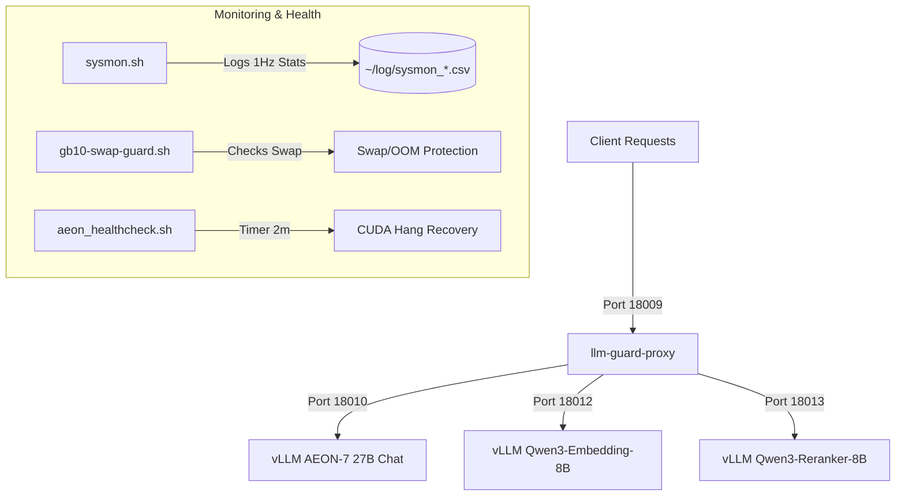

# GB10 AI Service Stack (DGX Spark OEM)

This repository contains the complete configuration, scripts, and systemd user services for deploying and maintaining the core AI inference service stack on a **DGX Spark** (or similar GB10-based OEM server). Its goal is to let an agent with GB10 operator access (`rootless-docker` plus `systemctl --user`) reproduce the same service layout used on the reference GB10 host.

The stack consists of **5 main services** (3 vLLM model endpoints, 1 loop/shielding proxy wrapper, and 1 system monitor) plus auxiliary helper services to ensure high availability, automatic failover, hang recovery, and memory protection.

---

## Architecture Overview



### The 5 Core Services
1. **vllm-aeon-27b-dflash.service**
   Serves the uncensored chat model (`aeon-ultimate`) utilizing the `DFlash` speculative decoding draft model. This is run inside the pinned AEON v0.24 GB10 Docker image for long-context processing up to 256k tokens, with FP8 KV cache and DFlash `TRITON_ATTN` enabled.
2. **vllm-embedding.service**
   Serves `Qwen/Qwen3-Embedding-8B` to handle vector embeddings. This is considered the reliability-critical baseline service. Its raw backend listens on port `18012`; clients should use `llm-guard-proxy` on port `18009` with model `qwen3-embedding-8b`.
3. **vllm-qwen3-reranker-8b.service**
   Serves `Qwen/Qwen3-Reranker-8B` for sequence classification and search rerank tasks, with the full 40k context profile restored. Its raw backend listens on port `18013`; clients should use `llm-guard-proxy` on port `18009` with model `qwen3-reranker-8b`.
4. **llm-guard-proxy.service**
   A Rust-based shielding gateway proxy ([llm-guard-proxy](https://github.com/RyderFreeman4Logos/llm-guard-proxy)) sitting in front of the chat, embedding, and reranker endpoints. It routes requests by `model` to named upstream profiles, manages request queues, retries, stalls, and loop guards to protect backends from runaway generations. It is also the runtime control plane for request concurrency: edit `config/llm-guard-proxy/config.toml` to tune `max_in_flight_requests` / `max_queued_generation_requests`, and the running proxy hot-reloads the config so operators can choose throughput versus single-stream latency without restarting vLLM.

   The proxy currently force-disables Qwen3.6-27B thinking by rewriting request parameters because the AEON thinking-loop issue is not fixed yet: [AEON-7/Qwen3.6-27B-AEON-Ultimate-Uncensored-DFlash#14](https://github.com/AEON-7/Qwen3.6-27B-AEON-Ultimate-Uncensored-DFlash/issues/14).
5. **sysmon.service**
   A lightweight system monitor script executing at 1Hz, recording system load, temperatures, GPU metrics, disk I/O rates, swap-in/out, and top process RSS/swap memory consumption.

### Auxiliary Services
*   **gb10-swap-guard.service**: Monitors swap space utilization at regular intervals. Prevents OOM crashes by terminating secondary container tasks if swap runs critical, protecting core services.
*   **aeon-healthcheck.timer & service**: A systemd timer that triggers every 2 minutes to check vLLM metrics. It automatically restarts the chat service if it detects a CUDA kernel hang (running requests with zero tokens/s and low GPU power).

### Reference Production Profile (2026-07-03)

The reference host currently runs all three vLLM services on:

```text
ghcr.io/aeon-7/aeon-vllm-ultimate:2026-07-01-v0.24.0
digest: sha256:f6d453d0b4a7ef90eefee486f4ff769cc2e1bb1e206df16d70370da09c02203c
```

Verified startup capacities:

```text
embedding:  max-model-len 40,960, KV 5,820M -> 41,376 tokens = 1.01015625x
AEON chat:  max-model-len 262,144, FP8 KV 15,360M -> 269,589 tokens = 1.028400421x
reranker:   max-model-len 40,960, KV 5,820M -> 41,376 tokens = 1.01015625x
```

For updates to any vLLM memory/context profile, use a full vLLM stack stop-before-start sequence. Stopping or restarting only one model can leave stale vLLM pages in swap.

---

## Directory Structure

```text
gb10-services/
├── LICENSE
├── README.md               # User guide (human-facing)
├── AGENTS.md               # Automated playbook (agent-facing)
├── config/
│   └── llm-guard-proxy/
│       └── config.toml     # llm-guard-proxy shielding rules & limits
├── scripts/
│   ├── aeon_chat_ready.py  # Waits for Chat vLLM metrics endpoint before starting reranker
│   ├── aeon_hang_guard.py  # Python hook script for Docker container hang protection
│   ├── aeon_healthcheck.sh # Main loop/CUDA hang detection bash script
│   ├── aeon_vllm_wrapper.py# Wrapper startup script for vLLM container
│   ├── gb10-swap-guard.sh  # Script to monitor swap usage and protect memory
│   └── sysmon.sh           # System performance and process metric logger (1Hz)
└── systemd/
    ├── aeon-healthcheck.service
    ├── aeon-healthcheck.timer
    ├── gb10-swap-guard.service
    ├── llm-guard-proxy.service
    ├── sysmon.service
    ├── vllm-aeon-27b-dflash.service
    ├── vllm-embedding.service
    └── vllm-qwen3-reranker-8b.service
```

---

## Prerequisites & Installation

### 1. Rootless Docker
The vLLM stack runs inside Docker. For safety and isolation, **Rootless Docker** is recommended.
* Ensure the Docker daemon socket is active at `unix:///run/user/$(id -u)/docker.sock`.
* Add `export DOCKER_HOST=unix:///run/user/$(id -u)/docker.sock` to your shell profile.

### 2. Hugging Face Models Cache
Pre-download the required model weights into `~/.cache/huggingface/` or prepare your local directories:
* **Chat Model**: `Qwen/Qwen3.6-27B-AEON-Ultimate-Uncensored-Multimodal-NVFP4-MTP-XS`
* **DFlash Draft Model**: `z-lab/Qwen3.6-27B-DFlash`
* **Embedding Model**: `Qwen/Qwen3-Embedding-8B`
* **Reranker Model**: `Qwen/Qwen3-Reranker-8B`

### 3. Build llm-guard-proxy
Clone and compile the proxy binary on the host machine:
```bash
git clone https://github.com/RyderFreeman4Logos/llm-guard-proxy.git
cd llm-guard-proxy
cargo build --release
cp target/release/llm-guard-proxy ~/.local/bin/
```

---

## Deployment Steps

### Step 1: Copy Scripts and Configurations
Make sure target directories exist, then copy scripts to your local bin and configurations:
```bash
mkdir -p ~/scripts ~/.local/bin ~/.config/llm-guard-proxy ~/log

# Copy scripts
cp scripts/aeon_vllm_wrapper.py ~/scripts/
cp scripts/aeon_hang_guard.py ~/scripts/
cp scripts/aeon_healthcheck.sh ~/scripts/
cp scripts/aeon_chat_ready.py ~/.local/bin/
cp scripts/sysmon.sh ~/.local/bin/
cp scripts/gb10-swap-guard.sh ~/.local/bin/

# Make scripts executable
chmod +x ~/scripts/*.sh ~/.local/bin/*

# Copy llm-guard-proxy config
cp config/llm-guard-proxy/config.toml ~/.config/llm-guard-proxy/config.toml
```

> [!NOTE]
> Update the IP address `100.105.4.92` in `systemd/*.service` and `config/llm-guard-proxy/config.toml` to match your local or Tailscale network interface IP address.

### Step 2: Install Systemd Services
Copy the user services to your user systemd configuration directory:
```bash
mkdir -p ~/.config/systemd/user/
cp systemd/* ~/.config/systemd/user/
```

### Step 3: Enable and Start the Stack
Reload systemd configurations and enable the services to persist across boot cycles:
```bash
systemctl --user daemon-reload

# Enable auxiliary services
systemctl --user enable --now sysmon.service
systemctl --user enable --now gb10-swap-guard.service
systemctl --user enable --now aeon-healthcheck.timer

# Enable model services
systemctl --user enable --now vllm-embedding.service
systemctl --user enable --now vllm-aeon-27b-dflash.service
systemctl --user enable --now vllm-qwen3-reranker-8b.service
systemctl --user enable --now llm-guard-proxy.service
```

For an update on an already-running host, stop all vLLM services first, then
start them in dependency order:

```bash
systemctl --user stop vllm-qwen3-reranker-8b.service
systemctl --user stop vllm-aeon-27b-dflash.service
systemctl --user stop vllm-embedding.service

systemctl --user start vllm-embedding.service
systemctl --user start vllm-aeon-27b-dflash.service
systemctl --user start vllm-qwen3-reranker-8b.service
systemctl --user start llm-guard-proxy.service
```

---

## Verifying Status

* **Process Status**:
  ```bash
  systemctl --user status vllm-embedding vllm-aeon-27b-dflash vllm-qwen3-reranker-8b llm-guard-proxy sysmon
  ```
* **Checking logs**:
  ```bash
  journalctl --user -u llm-guard-proxy.service -f
  ```
* **Performance Monitor**:
  The system monitor `sysmon` appends logs to `~/log/sysmon_$(date +%F).csv`. You can monitor real-time resource usage by tailing this file:
  ```bash
  tail -f ~/log/sysmon_$(date +%Y-%m-%d).csv
  ```

---

## License

This repository is licensed under the Apache License 2.0. See the `LICENSE` file for details.
