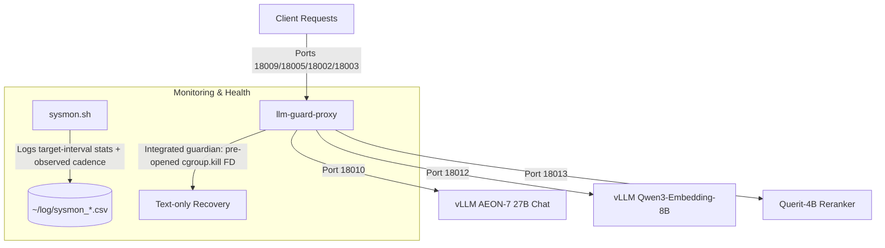

# GB10 AI Service Stack (DGX Spark OEM)

This repository contains the complete configuration, scripts, and systemd user services for deploying and maintaining the core AI inference service stack on a **DGX Spark** (or similar GB10-based OEM server). Its goal is to let an agent with GB10 operator access (`rootless-docker` plus `systemctl --user`) reproduce the same service layout used on the reference GB10 host.

The stack consists of **5 main services** (3 model endpoints, 1 loop/shielding proxy wrapper, and 1 system monitor). Host memory protection is integrated into `llm-guard-proxy`.

---

## Architecture Overview



### The 5 Core Services
1. **vllm-aeon-27b-dflash.service**
   Serves the uncensored chat model (`aeon-ultimate`) utilizing the `DFlash` speculative decoding draft model. This is run inside the pinned AEON v0.25 GB10 Docker image for long-context processing up to 256k tokens, with FP8 KV cache and DFlash `TRITON_ATTN` enabled.
2. **vllm-embedding.service**
   Serves BF16 `Qwen/Qwen3-Embedding-8B` with its full 4,096-dimensional output. This is the reliability-critical baseline service. The tracked source profile contracts for 32,768 tokens and 4,800 MiB explicit KV while preserving 8,192 batched tokens, 64 sequences, aliases, and quality semantics. It requests equal 128 GiB Docker memory/swap caps without imposing the obsolete 20 GiB service budget. Before readiness, its verifier binds the full Docker ID, PID, Docker `StartedAt`, `/proc` PID starttime and canonical Docker scope, scope inode, and `cgroup.events` population, then proves `HostConfig.MemorySwap == HostConfig.Memory`, `memory.swap.max == 0`, and `memory.swap.current == 0` on that unchanged generation. Its raw backend listens only on port `18012`; clients should use `llm-guard-proxy` on port `18009` or the guard-owned legacy listener `18002` with model `qwen3-embedding-8b`.
3. **vllm-querit-4b-reranker.service**
   The single canonical production owner for `Querit/Querit-4B` is a BF16 vLLM pooling reranker with the `qwen3-reranker-8b` and `Qwen/Qwen3-Reranker-8B` aliases, a 32,768-token context, 4,800 MiB KV cache, and equal 18 GiB Docker memory/swap caps. Its raw backend listens on `18013` with the live-proven AEON scheduler profile (`--max-num-batched-tokens 4096`, `--max-num-seqs 16`, and partial-prefill limits of one). Startup performs only the bounded rerank-readiness probe after launch; the static no-swap contract runs before launch and the migration owner performs generation-bound verification after start. Clients should use Guard on `18009` or the restricted listener `18003`. `vllm-qwen3-reranker-8b.service` remains a disabled fallback only.
4. **llm-guard-proxy.service**
   A Rust-based shielding gateway proxy ([llm-guard-proxy](https://github.com/RyderFreeman4Logos/llm-guard-proxy)) sitting in front of the chat, embedding, and reranker endpoints. It routes requests by `model` to named upstream profiles, manages request queues, retries, stalls, and loop guards to protect backends from runaway generations. It owns the stable entrypoint `18009`, aggregate listener `18005`, and legacy restricted listeners `18002`/`18003`; raw vLLM backends stay on `18010`/`18012`/`18013`. It is also the runtime control plane for request concurrency and the sole automatic low-memory recovery actor. Edit `config/llm-guard-proxy/config.toml` to tune limits or the hot-reloadable `[guardian]` policy without restarting vLLM.

   Queueing belongs primarily in Guard, not in an unbounded raw model adapter. The reference profile permits four concurrent body-routing reads and queues 128 requests before model routing; after routing it allows 4 active + 64 queued AEON requests, 8 + 64 embedding requests, and 8 + 64 Querit requests. Queued requests may wait up to 30 minutes. Only the 128-slot body-routing wait is pre-body and cheap; profile queues retain request bodies, so Guard caps every request at 4 MiB. The worst-case 216 body residencies use a documented 384 MiB baseline plus 1.5× body-overhead budget (1,680 MiB), below `MemoryHigh=1792M` and `MemoryMax=2G`. Querit vLLM uses the live-proven AEON scheduler ceilings (`--max-num-batched-tokens 4096`, `--max-num-seqs 16`), while Guard's lower hot-reloadable profile limit controls actual production concurrency. AEON keeps its own GB10 scheduler ceiling (`--max-num-seqs 16`).

   The reference config enables the production guard features that are useful on
   GB10: explicit named upstream profiles, bounded generation queues with HTTP
   `429`/`Retry-After`, model metadata enrichment, AEON chat hot-restart probes,
   stall detection, request parameter overrides for the AEON service-unit
   sampling defaults (`temperature=0.6`, `top_p=0.95`, `top_k=20`,
   `max_tokens=50000`), semantic loop detection, metrics, debug summaries,
   SQLite observability, full quality-debug evidence logging, SSE heartbeats, and
   Cloudflare-friendly streaming. Reasoning-loop failures use private CoT
   salvage (`loop_guard.on_reasoning_loop = "bounded_answer_from_cot"`) so the
   retry can answer from a bounded pre-loop reasoning prefix instead of falling
   straight to a no-thinking attempt. The proxy still keeps a shielded AEON
   retry ladder: max thinking, deep bounded thinking, bounded thinking, and
   final no-thinking fallback.

   Evidence is intentionally configured for loop-detector improvement rather
   than privacy-minimal production: redacted raw payloads, selected request
   headers, raw reasoning, loop shadow continuations, and 100% paired
   max/bounded/no-thinking comparisons are recorded within bounded retention.

   Normal chat uses `mode = "bounded_thinking"` with a 32,768-token thinking
   budget and explicit `vllm_native` injection: Guard preserves the template
   `enable_thinking` marker and sends the effective budget through vLLM's
   top-level `thinking_token_budget` field. Client no-thinking markers are respected:
   a request with `"chat_template_kwargs": {"enable_thinking": false}` should
   pass through without `reasoning_content`. Embedding and reranker profiles
   explicitly disable chat-only hot-restart probes, thinking rewrites, and
   parameter overrides.
5. **sysmon.service**
   A lightweight observer-only system monitor targeting a one-second interval,
   recording system load, exact Linux `MemAvailable`, temperatures, GPU metrics,
   disk I/O rates, swap-in/out, top process RSS/swap memory, and observed cadence.
   CSV v5 appends `mem_available_mb`, `sample_cadence_ms`,
   `sample_elapsed_ms`, and `sample_lag_ms` without reordering v4 columns. A
   2–3 second loop overrun is recorded as such; the service does not claim a
   guaranteed 1 Hz sampling rate and performs no recovery action.

### Integrated Guardian
`llm-guard-proxy` owns the only automatic low-memory recovery path. The GB10
profile samples `MemAvailable` every three seconds and sheds only the registered
`aeon-text` Docker cgroup below 5 GiB. The 5 GiB threshold is intentionally
earlier than the retired 2 GiB policy because the 2026-07-16 incident included
a 7.4 GiB allocation spike. The emergency path releases a touched 64 MiB reserve
before writing directly to a pre-opened `cgroup.kill` descriptor; it does not
invoke Docker or systemd under pressure. Embedding and reranker remain outside
the target set. `sysmon.service` remains the observer-only host monitor.

This service repository intentionally ships no standalone memory-guardian
Cargo workspace, binary, config, or unit. The external `llm-guard-proxy`
checkout owns the integrated guardian implementation and build. The retained
`%t/gb10-memory-guardian` name is only the runtime registration directory
shared by the proxy and text unit.

### Reference Production Profile (source updated 2026-07-17)

The tracked source selects this friendly release and immutable repository digest
for every AEON-backed unit. The running containers remain on their prior image
until a separately authorized deployment changes them.

```text
friendly tag: ghcr.io/aeon-7/aeon-vllm-ultimate:2026-07-16-v0.25.1
repository digest: sha256:c15e2c4b767c611fc739046129d550d0c347c906a3c9020888acc981f55f137d
rollback/superseded: ghcr.io/aeon-7/aeon-vllm-ultimate:2026-07-14-v0.25.0 @ sha256:18c09e6b80141a530285160781f7fa720a78ef91143b3c15a65a8c9641b44e55
runtime version: 0.25.1+aeon.sm121a.dflash
```

AEON build revision [`afd9b8b7`](https://github.com/AEON-7/vllm-ultimate-dgx-spark/commit/afd9b8b7faa6fbe2ceab13a14638e97dc5ca718f)
rebases to vLLM 0.25.1 and ports the MRv2 `lm_head` sharing fix to
DFlash, Eagle, and DSpark. It also includes upstream
[#47888](https://github.com/vllm-project/vllm/pull/47888), which prevents the
optional torchcodec import from blocking startup when FFmpeg is absent, and
[#48330](https://github.com/vllm-project/vllm/pull/48330), which guards the
mixed-dtype FlashInfer allreduce/RMSNorm/quant fusion for TP>1. Upstream labels
the DSpark loader fix-covered and TP=2-ready but still says TP>1 is unvalidated;
this repository does not claim a multi-Spark hardware validation.

Capacity contracts and evidence:

```text
embedding:  source max-model-len 32,768, KV 4,800M -> projected 34,124 tokens (4.14% margin; live verification pending)
            validated baseline: KV 5,820M -> 41,376 tokens
AEON chat:  source max-model-len 262,144, FP8 AUTO KV at gpu-memory-utilization 0.355
            -> clean-start capacity 286,962 tokens (not a live-production activation claim)
Querit:     canonical vLLM owner, max-model-len 32,768, KV 4,800M, Docker memory 18g
```

The committed Docker memory ceilings are AEON 128g, embedding 128g, and Querit 18g. They are independent hard ceilings, not co-resident reservations, and their sum is not a physical UMA-headroom guarantee. Every tracked vLLM unit requests `--memory-swappiness 0` with equal Docker memory/swap caps; the AEON vLLM fork does not support upstream `--swap-space`, so no tracked command passes that flag. Only the generation-bound live Docker-cgroup proof described above establishes `memory.max`, zero `memory.swap.max`, and zero activation-time `memory.swap.current`. A parent systemd service cgroup is not that proof. The historical 2026-07-14 live receipt records a prior 15 GiB text KV activation at 269,589 cache tokens, a 2.84% margin above one 262,144-token request, and about 31.6 GiB `MemAvailable` after its first 3,300-second attribution window; it is not the current AUTO-KV source profile. With the former 36 GiB text KV profile, stable all-three samples left only about 1.8–2.3 GiB `MemAvailable`, and the same text configuration had previously grown another 8,466 MiB. Two concurrent maximum-length requests are not supported; this is intentional under the service priority embedding > reranker > text. Use `scripts/gb10_apply_aeon_querit_profile.sh` for the reranker migration; it verifies the existing AEON and embedding no-swap generations before and after the switch and leaves text, embedding, and Guard state unchanged.

---

## Directory Structure

```text
gb10-services/
├── LICENSE
├── README.md               # User guide (human-facing)
├── config/
│   └── llm-guard-proxy/
│       └── config.toml     # Proxy routing, shielding, and guardian policy
├── docs/
│   ├── deployment/
│   │   └── AGENTS.md       # Agent-facing service deployment playbook
│   └── research/           # Tracked dated source/live research and decisions
├── scripts/
│   ├── aeon_chat_ready.py  # Waits for Chat vLLM metrics endpoint before starting reranker
│   ├── aeon_hang_guard.py  # Python hook script for Docker container hang protection
│   ├── aeon_vllm_wrapper.py# Wrapper startup script for vLLM container
│   ├── gb10_apply_aeon_querit_profile.sh # Guarded Querit migration/deployer
│   ├── gb10_check_mem_available.sh # Model startup headroom gate
│   ├── llm_guard_proxy_publish_cgroup_registration.sh # Publish exact AEON cgroup identity
│   ├── querit_openai_rerank_server.py # Historical reproducibility adapter
│   └── sysmon.sh           # Observer-only metrics with measured sample cadence
└── systemd/
    ├── llm-guard-proxy.service
    ├── vllm-querit-4b-reranker.service
    ├── sysmon.service
    ├── vllm-aeon-27b-dflash.service
    ├── vllm-embedding.service
    └── vllm-qwen3-reranker-8b.service # disabled fallback only
```

---

## Prerequisites & Installation

### 1. Rootless Docker
The vLLM stack runs inside Docker. For safety and isolation, **Rootless Docker** is recommended.
* Ensure the Docker daemon socket is active at `unix:///run/user/$(id -u)/docker.sock`.
* Add `export DOCKER_HOST=unix:///run/user/$(id -u)/docker.sock` to your shell profile.

### 2. Hugging Face Models Cache
Pre-download the required model weights into `~/.cache/huggingface/` or prepare your local directories:
* **Chat Model**: `Qwen/Qwen3.6-27B-AEON-Ultimate-Uncensored-Multimodal-NVFP4-MTP-XS`
* **DFlash Draft Model**: `z-lab/Qwen3.6-27B-DFlash`
* **Embedding Model**: `Qwen/Qwen3-Embedding-8B`
* **Reranker Model**: `Querit/Querit-4B`, snapshot `7b796de30ad8dc772d6c46c75659c1341283a665`

### 3. Build llm-guard-proxy
Build/update the proxy binary on the host machine from the reviewed main branch.
The cached rebuild script uses a local workspace checkout plus a persistent Cargo
target cache, so path dependencies such as `llm-guard-proxy-core` are built from
the same commit and future GB10 updates do not recompile dependencies from
scratch:
```bash
~/.local/bin/llm_guard_proxy_cached_rebuild.sh
```

The script keeps build artifacts in
`~/.cache/cargo-target/llm-guard-proxy-main` and relinks
`~/.local/bin/llm-guard-proxy` to the workspace-built release binary. If a
standalone rebuild leaves the running guard process on a deleted old inode, the
script restarts only `llm-guard-proxy.service` and smokes `/health`; it does not
restart any vLLM backend.

### 4. Verify the integrated guardian

The guardian ships in the `llm-guard-proxy` binary. The tracked GB10 config
enables target `aeon-text`, direct `cgroup-kill`, a 5 GiB threshold, and a
three-second poll. The text unit publishes `text-cgroup.v1` atomically after
each Docker generation so the proxy can replace its retained descriptors.

---

## Deployment Steps

### Step 1: Copy Scripts and Configurations
Make sure target directories exist, then copy scripts to your local bin and configurations:
```bash
mkdir -p ~/scripts ~/.local/bin ~/.config/llm-guard-proxy ~/log

# Copy scripts
cp scripts/aeon_vllm_wrapper.py ~/scripts/
cp scripts/aeon_hang_guard.py ~/scripts/
cp scripts/aeon_chat_ready.py ~/.local/bin/
cp scripts/gb10_apply_aeon_querit_profile.sh ~/.local/bin/
cp scripts/gb10_check_mem_available.sh ~/.local/bin/
cp scripts/llm_guard_proxy_cached_rebuild.sh ~/.local/bin/
cp scripts/llm_guard_proxy_publish_cgroup_registration.sh ~/.local/bin/
install -m 0644 scripts/gb10_verify_vllm_no_swap_core.py ~/.local/bin/gb10_verify_vllm_no_swap_core.py
install -m 0755 scripts/gb10_verify_vllm_no_swap.sh ~/.local/bin/gb10_verify_vllm_no_swap.sh
cp scripts/sysmon.sh ~/.local/bin/


# Make scripts executable
chmod +x ~/scripts/*.sh
chmod +x ~/.local/bin/aeon_chat_ready.py ~/.local/bin/gb10_apply_aeon_querit_profile.sh \
  ~/.local/bin/gb10_check_mem_available.sh ~/.local/bin/llm_guard_proxy_cached_rebuild.sh \
  ~/.local/bin/llm_guard_proxy_publish_cgroup_registration.sh ~/.local/bin/sysmon.sh

# Copy llm-guard-proxy config
cp config/llm-guard-proxy/config.toml ~/.config/llm-guard-proxy/config.toml
```

> [!NOTE]
> Update the IP address `100.105.4.92` in `systemd/*.service` and `config/llm-guard-proxy/config.toml` to match your local or Tailscale network interface IP address.

### Step 2: Install Systemd Services
```bash
mkdir -p ~/.config/systemd/user/
install -m 0644 systemd/llm-guard-proxy.service \
  systemd/vllm-querit-4b-reranker.service systemd/sysmon.service \
  systemd/vllm-aeon-27b-dflash.service systemd/vllm-embedding.service \
  systemd/vllm-qwen3-reranker-8b.service \
  ~/.config/systemd/user/
```

### Step 3: Enable and Start the Stack
Reload systemd configurations and enable the services to persist across boot cycles:
```bash
systemctl --user daemon-reload

systemctl --user enable --now sysmon.service

# Model services remain independent from the proxy lifecycle.
systemctl --user enable --now vllm-embedding.service
systemctl --user enable --now vllm-aeon-27b-dflash.service
systemctl --user disable --now vllm-qwen3-reranker-8b.service
systemctl --user enable --now vllm-querit-4b-reranker.service
systemctl --user enable --now llm-guard-proxy.service

```

The text unit has `Restart=always`, so an integrated-guardian cgroup kill
converges through systemd. The publisher validates the exact rootless Docker
scope and writes only the owner-only registration; it does not set cgroup limits.
Neither the proxy nor text owns embedding/reranker lifecycle.

### Embedding 32K profile activation and rollback

The tracked 32,768-token / 4,800 MiB KV profile is source-first and uses an
equal 128 GiB Docker memory/swap caps without imposing the obsolete 20 GiB
service budget. Its post-start verifier must prove the full immutable Docker and
`/proc` identity plus the unchanged exact Docker scope, inode, population,
`memory.max`, `memory.swap.max`, and activation-time `memory.swap.current`
before the unit is active. It must be activated as a
**single-unit** transaction. Do not stop or restart text,
either reranker, or the proxy, and do not copy/sync unrelated files from this
branch. The production entry point accepts no arguments or environment path/tool
overrides:

```bash
scripts/gb10_activate_embedding_profile.sh
```

The activator locks a private owner-only state directory, rejects canonical
source drift, and durably records exact prior unit and no-swap-helper bytes/mode
or explicit absence before mutation. It atomically installs source-identical
helper and unit bytes and restores both exactly on rollback. It also brackets baseline capture with stable embedding
and text/reranker generations. It installs atomically, reloads systemd, restarts
only `vllm-embedding.service`, and requires a new `InvocationID`, PID, and
monotonic start generation. It then invokes the canonical fail-closed verifier;
the caller cannot substitute a unit, verifier, Docker command, or evidence path.

Commit requires the canonical `qwen3-embedding-8b-32k-4800M-128GiB` receipt
profile and exact 128g memory/swap plus zero-swappiness Docker argv, current
systemd/cgroup/container generation, all intended engine-process
metrics, startup capacity of at least 32,768 tokens, exact model aliases, and
finite 4,096-dimensional fixture vectors. The fixture proves only repeat/alias
cosine stability at `0.99999` and unchanged nearest-neighbor ordering; it does
not claim general embedding quality. Text/reranker generation receipts must
remain byte-for-byte unchanged. Until a live activation commits these private
receipts, the profile is projected and **not production-verified**.

`HUP`, `INT`, `TERM`, exceptions, bounded-command failures, stale transactions,
and pre-commit receipt failures restore the exact prior unit state, reload, and
restart only embedding. Activation requires an already-active/running embedding
service; rollback proves a fresh stable restored generation/readiness and
unchanged neighbor generations. A failed rollback preserves
owner-only `rollback_failed` state for the next locked invocation. The durable
phase is authoritative: interruption after `committed` never rolls back. Private
activation receipts explicitly require that phase and are not commit claims on
their own. Activation and rollback evidence lives under
`$HOME/.local/state/gb10-embedding-activation/`. Never replace this transaction
with manual copy/reload/restart or stack-cycle fragments.

## Verifying Status

* **Process Status**:
  ```bash
  systemctl --user status vllm-embedding vllm-aeon-27b-dflash vllm-querit-4b-reranker llm-guard-proxy sysmon
  ```
* **Checking logs**:
  ```bash
  journalctl --user -u llm-guard-proxy.service -f
  ```
* **Performance Monitor**:
  The system monitor `sysmon` appends logs to `~/log/sysmon_$(date +%F).csv`. You can monitor real-time resource usage by tailing this file:
  ```bash
  tail -f ~/log/sysmon_$(date +%Y-%m-%d).csv
  ```

---

## License

This repository is licensed under the Apache License 2.0. See the `LICENSE` file for details.
